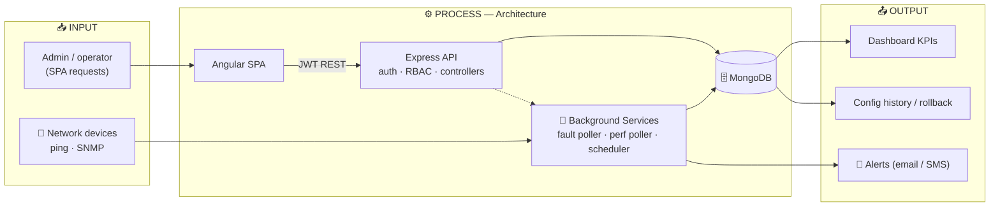

<h1 align="center">🌐 NMS — Network Management System</h1>

<p align="center">
  <b>Full-stack enterprise platform for monitoring & managing network infrastructure</b><br/>
  Real-time fault detection, performance monitoring, config version control,<br/>
  multi-channel alerting, and role-based administration.
</p>

<p align="center">
  
  
  
  
  
  
</p>

---

## 📖 Overview

**NMS** is an enterprise-grade platform for monitoring and managing network infrastructure. It delivers real-time fault detection, performance monitoring, device inventory, configuration version control, alert management, and user administration with role-based access control.

### 🎯 What it does

- 📡 Monitors device reachability via **ICMP ping** with dampening + root-cause analysis (RCA)
- 📊 Collects **SNMP / SSH / REST / WMI** metrics (CPU, memory, bandwidth, latency)
- 🗂️ Maintains device **config history** with diff-based version control & rollback
- 🔔 Dispatches fault/recovery alerts via **email (Nodemailer)** and **SMS (Twilio)**
- 📈 Surfaces live KPIs — uptime %, alert counts, device health — on a dashboard

---

## 🏗️ Architecture



The SPA talks to the API over authenticated REST, while three background services run outside the request lifecycle — continuously polling devices, collecting metrics, and dispatching alerts.

### Background services (auto-started in `server.js`)

1. **`pollDevices`** — ICMP fault loop with three-strike dampening, RCA via `parentId` topology, alert creation, SMS/email dispatch.
2. **`startPerformancePoller`** — cron-scheduled SNMP collection stored as time-series docs with 30-day TTL.
3. **`initializeScheduler`** — user-configurable alert suppression and cron automation.

---

## 🧠 RCA & Dampening

The fault poller tracks consecutive failures per device. After `MAX_STRIKES` failures the device is marked offline. When a device goes down, any devices referencing it as `parentId` have their alerts marked `suppressed: true, isRootCause: false` — keeping **only the root device's alert actionable**.

---

## 🗄️ Data Model

| Collection | Purpose | Key fields |
|---|---|---|
| `users` | Auth & RBAC | `email`, `role` (admin/operator/viewer), `requiresPasswordReset`, `resetPasswordToken` |
| `devices` | Inventory | `hostname`, `managementIp`, `type`, `status`, `parentId`, `protocol`, `currentConfig`, `currentVersion` |
| `alerts` | Fault events | `device`, `severity`, `type`, `status`, `isRootCause`, `suppressed`, `acknowledgedBy` |
| `performancemetrics` | Time-series (30-day TTL) | `device`, `timestamp`, `latencyMs`, `cpuUtilization`, `memoryUtilization`, `bandwidthIn/Out`, `packetLoss` |
| `configversions` | Config history | `device`, `version`, snapshot, diff |

---

## 🔐 RBAC

Three roles — **admin · operator · viewer** — enforced per route:

```javascript
// Backend
router.delete('/:id', verifyToken, requireRole(['admin']), deleteUser);

// Frontend
// authGuard checks AuthService.isLoggedIn() → nms_token in localStorage
```

| Route | Component | Access |
|---|---|---|
| `/auth/login` | LoginComponent | public |
| `/dashboard` | DashboardComponent | authGuard |
| `/inventory` | InventoryComponent | authGuard |
| `/alerts` | AlertsComponent | authGuard |
| `/users` | UsersComponent | authGuard + admin |

---

## 🚀 Getting Started

### Backend
```bash
cd backend
npm install
npm run dev      # nodemon (dev)
npm start        # production
```

### Frontend
```bash
cd frontend
npm install
npm start        # dev → http://localhost:4200
npm run build    # → dist/nms-frontend/
npm test         # Karma + Jasmine
```

### Health check
```bash
curl http://localhost:5000/api/health    # → { "status": "UP" }
```

---

## ⚙️ Configuration

Create `backend/.env` (not committed):

```env
MONGO_URI=mongodb://127.0.0.1:27017/nms
JWT_SECRET=your-long-random-secret-string

# Optional — defaults shown:
PORT=5000
CORS_ORIGIN=http://localhost:4200
POLL_INTERVAL_S=60          # fault poller interval
PING_TIMEOUT_S=2            # ICMP timeout
MAX_STRIKES=3               # dampening strikes before offline
PERF_POLL_CRON=*/5 * * * *  # performance poller schedule
```

---

## 🗂️ Key Files

| Concern | File |
|---|---|
| Server entry point | `backend/server.js` |
| JWT + RBAC middleware | `backend/middleware/role.middleware.js` |
| Fault polling engine | `backend/utils/poller.service.js` |
| SNMP performance polling | `backend/utils/performance.poller.js` |
| SNMP OID definitions | `backend/utils/snmp.service.js` |
| Email / SMS | `backend/utils/email.service.js` · `sms.service.js` |
| Angular routes | `frontend/src/app/app.routes.ts` |
| Auth service / guard | `frontend/src/app/core/services/auth.service.ts` · `guards/auth.guard.ts` |

---

## 🧰 Tech Stack

| Layer | Technologies |
|---|---|
| **Backend** | Node.js · Express · Mongoose · JWT · bcrypt |
| **Monitoring** | ICMP ping · SNMP / SSH / REST / WMI · node-cron |
| **Notifications** | Nodemailer · Twilio |
| **Frontend** | Angular 19 · TypeScript |
| **Database** | MongoDB (TTL time-series) |

---

<p align="center">
  <a href="https://www.linkedin.com/in/abbunitheesreddy/"></a>
  <a href="https://github.com/AbbuNitheesReddy"></a>
  <a href="mailto:nithish.7098@gmail.com"></a>
</p>
<p align="center"><i>Built by Abbu Nithees Reddy</i></p>
